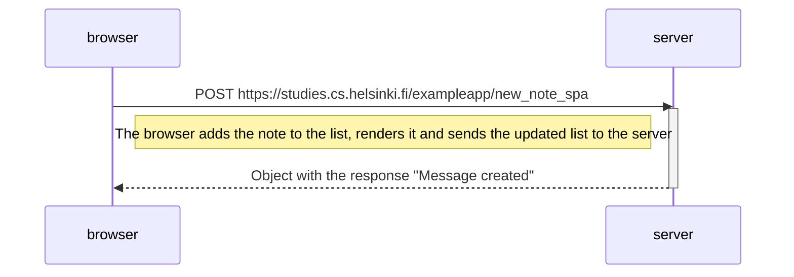

```mermaid
sequenceDiagram
        participant browser
        participant server

        browser->>server: POST https://studies.cs.helsinki.fi/exampleapp/new_note_spa
        activate server
        Note right of browser: The browser adds the note to the list, renders it and sends the updated list to the server
        server-->>browser: Object with the response "Message created"
        deactivate server
``` 